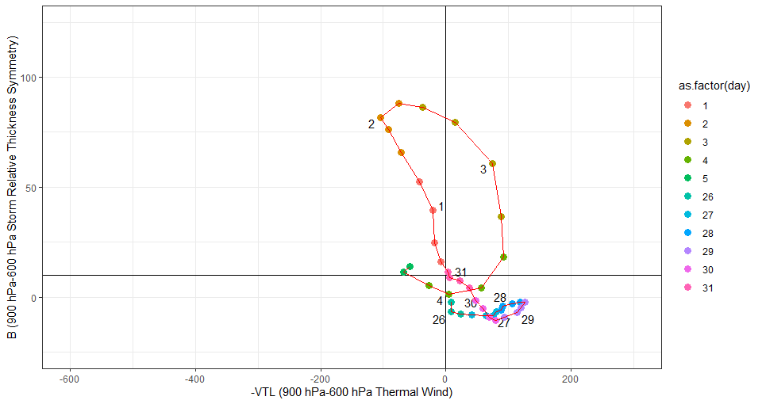
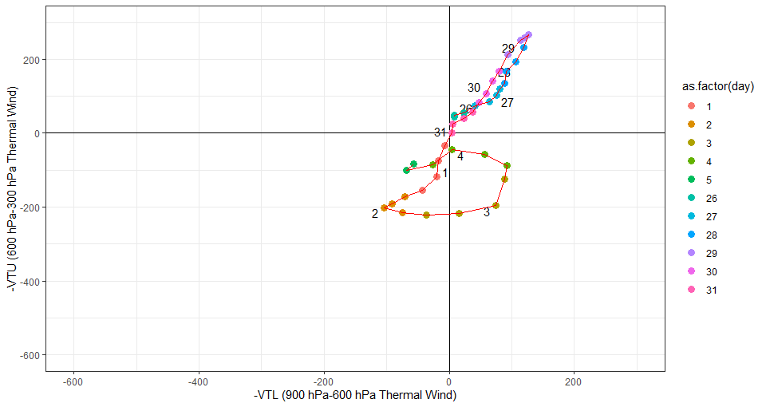
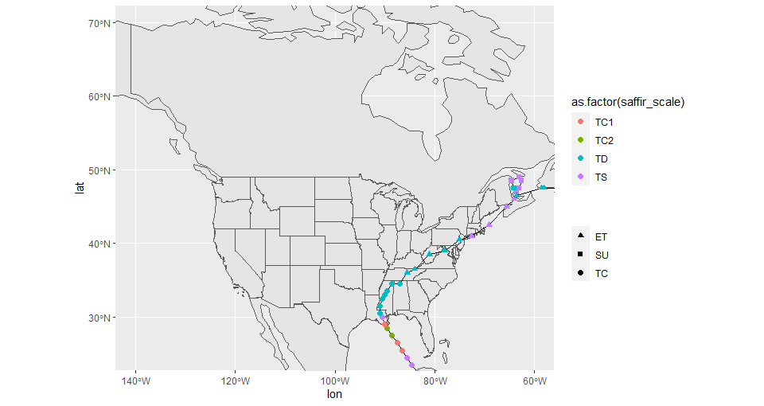
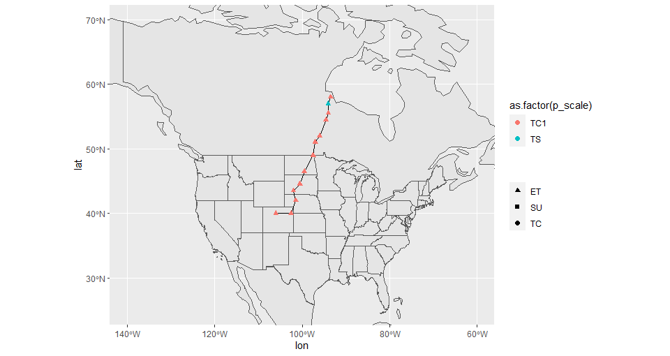

# low_tracks
An R tool to plot tracks of meteorological cyclones. This tool grabs data from the GFS or HRRR models,
and finds the track of a low pressure system within a given date range and starting location. This tool
can also plot the paths using ggplot. The tool requires pacman to load packages.

# Examples

## Phase diagrams and track of Hurricane Ida from GFS model

```r
ida <- get_track(as.Date("2021-08-26"),as.Date("2021-09-05"),
                    model='gfs',min_time = 0, center=c(15.8, -74.8),
                    center_radius=3, max_dist = 6)
# Plot a B (thermal asymmetry) vs -VTL (lower level vertical wind) chart
# Values of B greater than 10 indicate an asymmetric (frontal) structure,
# values less than 10 indicate a symmetric (nonfrontal) cyclone structure.
# Values of -VTL greater than 0 indicate a lower level warm core, while
# values less than 0 indicate a lower level cold core.
# values of -VTU indicate the same as -VTL except for upper levels.
plot_phase(ida, T, smooth=4)
```



```r
plot_phase(ida, F, smooth=4)
```



Compare these phase plots to the [phase plots of Ida](http://moe.met.fsu.edu/cyclonephase/archive/2021/) created at Florida State University.

```r
plot_track(ida, scale="ss")
```



Compare this track to the [track of Ida from Wikipedia](https://en.wikipedia.org/wiki/Hurricane_Ida#/media/File:Ida_2021_track.png). It seems like GFS tends to underestimate the maximum wind speed of the storm, likely because it shows the average wind speed in a grid square, not the maximum.

## Path of October 2021 North American Winter Storm

```r
oct21 <- get_track(as.Date("2021-10-12"),as.Date("2021-10-15"),
                                 model='gfs',min_time=18, center=c(38.9, -104.8),
                                  center_radius=3, max_dist=4)
# Plot track of October 2021 storm according to pressure scale Arthur, W. C. & Woolf, H. M. 2013)
plot_track(oct21, scale="p")
```



Compare this track to the [track From Wikipedia](https://en.wikipedia.org/wiki/2021%E2%80%9322_North_American_winter#/media/File:October_2021_winter_storm_track.png).

# Roadmap

## Done
- Docstring documentation
- Add graphic
- Add low track data
- Add GFS
- Add HRRR
- Add more examples, with screenshots
- Add documentation for phase space
- Export to [HURDAT](https://www.aoml.noaa.gov/hrd/data_sub/newHURDAT.html).
- Documentation for HURDAT


## Possible future items
- NCEP model
